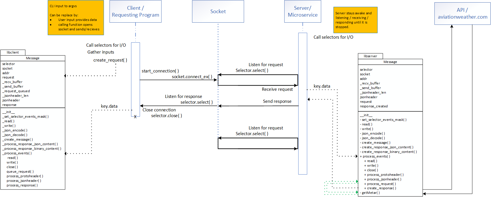

# getMetar
Weather api interface

1. Launch app server using the CLI command format: python app-server.py <host> <port>

2. In a separate terminal, launch app client using the CLI command format: python app-client.py <host> <port> "metar" "[airport]" hoursBefore

where airport is the ICAO identifier for the weather reporting station (str)   
and hoursBefore is an optional input for historical data (int)

Sample server input: python app-server.py 127.0.0.1 8000   
Sample client input: python app-client.py 127.0.0.1 8000 "metar" "KSEA" 4

UML Diagram

